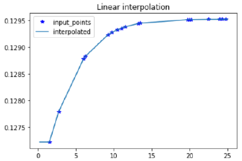
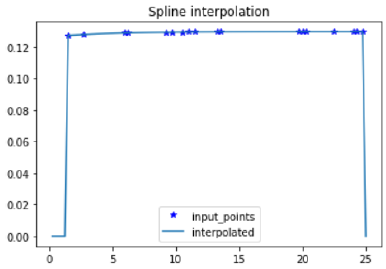
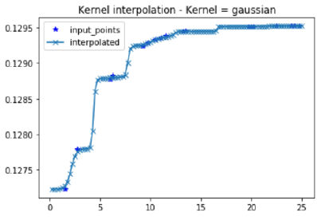
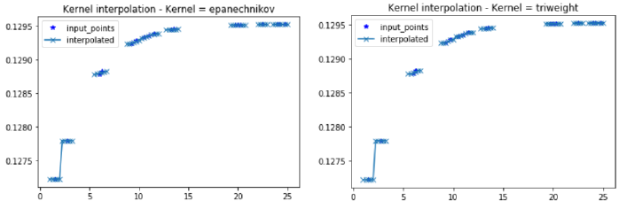
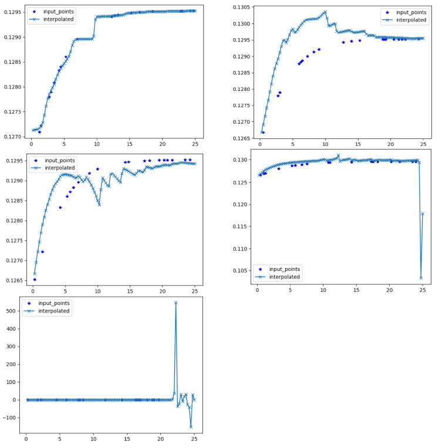
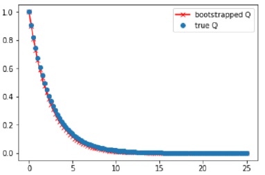

# Credit Curve Construction

## Target
Learning credit spread curves from the market spread term structure

## Results
### Vanilla construction

### Spline construction

### Kernel learning construction

### Local polynomial construction

### Boostrapped survival curve 

